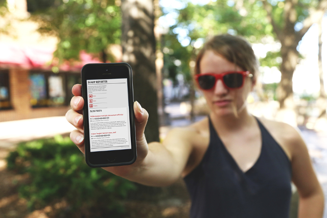

# Sharp Reporter: A Bootstrap responsive blog theme

**Sharp Reporter** is a free  Twitter Bootstrap 3 template by [www.digibrady.com](http://www.digibrady.com).  It has a clean, minimalistic layout with fixed header, sidebar, and footer.  Its crisp red, gray, and black colors make for easy reading.  It's good for a personal blog or simple portfolio website.  

**For a Live Demo** [click here](http://www.digibrady.com/portfolio/bootstrap-responsive-theme-sharpreporter.html)

